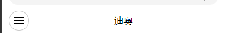
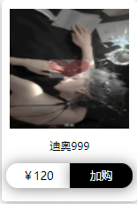
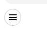
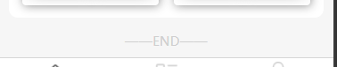
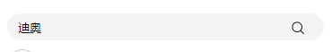

[toc]

#小程序前端组件文档

##home 首页组件

###about 组件

<br>

> 头像介绍组件


**属性列表**

| 属性名  | 类型   | 是否必填 | 默认值   | 其他     |
| ------- | ------ | -------- | -------- | -------- |
| title   | string | 否       | 空字符串 | 用户名   |
| iconUrl | string | 是       | null     | 用户头像 |

<br>

---

<br>

##menu 产品分类页组件

<br>

###titleMenu 组件

<br>

> 产品列表页的标题和按钮部分组件



**属性列表**

| 属性名 | 类型   | 是否必填 | 默认值 | 其他           |
| ------ | ------ | -------- | ------ | -------------- |
| title  | string | 是       | ""     | 标题显示的文本 |

<br>

**事件方法列表**

| 事件名    | 类型     | 是否必填 | 参数 | 其他             |
| --------- | -------- | -------- | ---- | ---------------- |
| iconClick | function | 否       | 无   | 面包按钮点击事件 |

<br>

---

<br>

##product 产品列表页组件

<br>

> 暂无数据

---

<br>

##shopCart 购物车页组件

<br>

> 暂无数据

---

<br>

##details 产品详情页组件

<br>

> 暂无数据

---

<br>

##searchPage 搜索页组件

<br>

> 暂无数据

---

<br>

##public 公共组件

<br>

###globalLoading 全局加载组件

<br>

> 整个页面的加载组件，页面加载时展示，有一个又白色透明度的背景蒙版


**属性列表**

| 属性名 | 类型    | 是否必填 | 默认值 | 其他             |
| ------ | ------- | -------- | ------ | ---------------- |
| show   | boolean | 否       | true   | 控制是否显示组件 |

<br>

---

<br>

###listItem 列表卡片组件

<br>

> 产品列表的每项展示卡片



**属性列表**

| 属性名 | 类型   | 是否必填 | 默认值 | 其他               |
| ------ | ------ | -------- | ------ | ------------------ |
| item   | Object | 是       | {}     | 卡片显示的所有数据 |

<br>

**item 所需属性**

| 属性名      | 类型   | 默认值 | 其他                                 |
| ----------- | ------ | ------ | ------------------------------------ |
| imgs        | array  | []     | 商品图片地址数组，每项为 string 类型 |
| productName | string | ""     | 商品名称                             |
| currentPric | number | 无     | 商品价格                             |

<br>

**事件方法列表**

| 事件名  | 类型     | 是否必填 | 参数 | 其他                 |
| ------- | -------- | -------- | ---- | -------------------- |
| onClick | function | 否       | 无   | 卡片点击跳转详情事件 |

<br>

---

<br>

###localLoading 局部加载组件

<br>

> 局部加载时展示的组件


**属性列表**

| 属性名 | 类型    | 是否必填 | 默认值 | 其他                     |
| ------ | ------- | -------- | ------ | ------------------------ |
| show   | boolean | 否       | true   | 控制局部加载组件是否显示 |

<br>

###menuButton 面包屑按钮组件

<br>

> 面包屑按钮组件



**事件方法列表**

| 事件名    | 类型     | 是否必填 | 参数 | 其他               |
| --------- | -------- | -------- | ---- | ------------------ |
| iconClick | function | 否       | 无   | 面包屑按钮点击事件 |

<br>

---

<br>

###notData 底部无数据展示组件

<br>

> 列表展示完后底部显示组件



**属性列表**

| 属性名 | 类型   | 是否必填 | 默认值 | 其他         |
| ------ | ------ | -------- | ------ | ------------ |
| text   | string | 否       | 'END'  | 组件显示文本 |

<br>

---

<br>

###search 搜索框组件

<br>

> 搜索框组件



**属性列表**

| 属性名      | 类型   | 是否必填 | 默认值 | 其他               |
| ----------- | ------ | -------- | ------ | ------------------ |
| iconColor   | string | 否       | #000   | 搜索框搜索图标颜色 |
| size        | number | 否       | 20     | 搜索框搜索图标大小 |
| searchValue | string | 否       | ""     | 搜索框初始值       |

<br>

**事件方法列表**

| 事件名   | 类型     | 是否必填 | 参数            | 其他             |
| -------- | -------- | -------- | --------------- | ---------------- |
| mychange | function | 否       | 事件参数 events | 搜索框值变换事件 |
| search   | function | 否       | 搜索框 value    | 搜索框搜索事件   |
| click    | function | 否       | 事件参数 events | 搜索框点击事件   |

<br>

---

<br>

###empty 无数据空页面展示组件

<br>

> 暂无数据

---

<br>

#小程序服务器接口文档

> 测试地址：http://127.0.0.1:12307

> 生产环境地址：http://81.70.89.166:12306

<br>

##tag 标签 api 接口

<br>

###增

<br>

> 新增一条标签

methods: POST  
api: /api/tag

**所需属性**

| 属性名 | 类型            | 是否必填 | 默认值 | 其他         |
| ------ | --------------- | -------- | ------ | ------------ |
| title  | string          | 是       | 无     | 一级导航标题 |
| child  | Array\<String\> | 是       | []     | 二级导航文本 |

<br>

**返回数据**

> 暂无数据

<br>

---

<br>

###删

methods: DELETE  
api: /api/tag

**所需属性**

| 属性名 | 类型   | 是否必填 | 默认值 | 其他                                 |
| ------ | ------ | -------- | ------ | ------------------------------------ |
| \_id   | string | 是       | 无     | mongoose 自动生成的属性 ObjectId\(\) |

<br>

**返回数据**

> 暂无数据

<br>

---

<br>

###改

methods: PUT  
api: /api/tag/:\_id\(\_id 是 mongoose 自动生成的属性 ObjectId())

**所需属性**

| 属性名 | 类型            | 是否必填 | 默认值 | 其他         |
| ------ | --------------- | -------- | ------ | ------------ |
| title  | string          | 是       | 无     | 一级导航标题 |
| child  | Array\<String\> | 是       | []     | 二级导航文本 |

<br>

**返回数据**

> 暂无数据

<br>

---

<br>

###查

methods: GET
api: /api/tag

<br>

**所需属性**

> 无需属性

**返回数据**

```js
[
  {
    child: [
      "迪奥",
      "娇兰",
      "雅诗兰黛",
      "修丽可",
      "圣罗兰",
      "阿玛尼",
      "纪梵希",
      "nars",
      "mac",
      "sk2",
      "cpb",
      "理肤泉",
      "娇韵诗",
      "TF",
      "芭比布朗",
      "兰蔻",
      "宝格丽",
      "郁美净",
    ],
    _id: "607efa77830c723fb0fcac84",
    title: "品牌",
    __v: 0,
  },
];
```

---

<br>

##product 商品 api 接口

<br>

###增

> 新增一条标签

methods: POST  
api: /api/product

**所需属性**

| 属性名        | 类型           | 是否必填 | 默认值 | 其他             |
| ------------- | -------------- | -------- | ------ | ---------------- |
| productName   | string         | 是       | 无     | 商品名称         |
| originPric    | number         | 是       | 无     | 商品原价         |
| currentPric   | number         | 是       | 无     | 商品现价         |
| imgs          | Array\<String> | 是       | []     | 商品图片数组     |
| tag           | string         | 是       | ""     | 商品标签         |
| stock         | number         | 是       | 无     | 库存             |
| options       | Object         | 是       | {}     | 商品规格信息     |
| optionsDetail | Object         | 是       | {}     | 商品规格价格映射 |

<br>

**options 商品规格信息**

| 属性名 | 类型           | 是否必填 | 默认值 | 其他     |
| ------ | -------------- | -------- | ------ | -------- |
| name   | string         | 是       | 无     | 规格名称 |
| child  | Array\<String> | 是       | []     | 规格列表 |

<br>

**optionsDetail 商品规格价格映射**

| 属性名 | 类型   | 是否必填 | 默认值 | 其他                               |
| ------ | ------ | -------- | ------ | ---------------------------------- |
| price  | number | 是       | 无     | 价格                               |
| total  | number | 是       | 无     | 库存数量                           |
| type   | string | 是       | 无     | 商品规格信息，例：（'大小\_颜色'） |

<br>

**返回数据**

> 暂无数据

<br>

---

<br>

###删

methods: DELETE  
api: /api/product

**所需属性**

| 属性名 | 类型   | 是否必填 | 默认值 | 其他                                 |
| ------ | ------ | -------- | ------ | ------------------------------------ |
| \_id   | string | 是       | 无     | mongoose 自动生成的属性 ObjectId\(\) |

<br>

**返回数据**

> 暂无数据

<br>

---

<br>

###改

methods: PUT  
api: /api/product/:id(\_id 是 mongoose 自动生成的 ObjectId())

**所需属性**

| 属性名        | 类型           | 是否必填 | 默认值 | 其他             |
| ------------- | -------------- | -------- | ------ | ---------------- |
| productName   | string         | 是       | 无     | 商品名称         |
| originPric    | number         | 是       | 无     | 商品原价         |
| currentPric   | number         | 是       | 无     | 商品现价         |
| imgs          | Array\<String> | 是       | []     | 商品图片数组     |
| tag           | string         | 是       | ""     | 商品标签         |
| stock         | number         | 是       | 无     | 库存             |
| options       | Object         | 是       | {}     | 商品规格信息     |
| optionsDetail | Object         | 是       | {}     | 商品规格价格映射 |

<br>

**options 商品规格信息**

| 属性名 | 类型           | 是否必填 | 默认值 | 其他     |
| ------ | -------------- | -------- | ------ | -------- |
| name   | string         | 是       | 无     | 规格名称 |
| child  | Array\<String> | 是       | []     | 规格列表 |

<br>

**optionsDetail 商品规格价格映射**

| 属性名 | 类型   | 是否必填 | 默认值 | 其他                               |
| ------ | ------ | -------- | ------ | ---------------------------------- |
| price  | number | 是       | 无     | 价格                               |
| total  | number | 是       | 无     | 库存数量                           |
| type   | string | 是       | 无     | 商品规格信息，例：（'大小\_颜色'） |

<br>

**返回数据**

> 暂无数据

<br>

---

<br>

###查

methods: GET

api: /api/product

**所需属性**

| 属性名                         | 类型                     | 是否必填 | 默认值 | 其他               |
| ------------------------------ | ------------------------ | -------- | ------ | ------------------ |
| page                           | number                   | 否       | 无     | 分页页码           |
| size                           | number                   | 否       | 无     | 分页页容量         |
| tag                            | string                   | 否       | 无     | 搜索标签关键字     |
| productName                    | string                   | 否       | 无     | 搜索商品名称关键字 |
| start                          | number                   | 否       | 无     | 价格起始筛选条件   |
| end                            | number                   | 否       | 无     | 价格结束筛选条件   |
| orgingPrice/currentPrice/ctime | number('1'正序/'-1'倒序) | 否       | 无     | 排序条件           |

<br>

**返回结果**

```javascript
[
  {
    productName: "迪奥999",
    originPric: 200,
    currentPric: 120,
    imgs: ["/123.jpg", "234.jpg"],
    tag: "迪奥,口红",
    stock: 20,
    options: [
      { name: "色号", child: ["999", "888", "777"] },
      { name: "大小", child: ["大", "中", "小"] },
    ],
    optionsDetail: [{ type: "999-大", price: 120, total: 2 }],
  },
];
```

<br>

***
